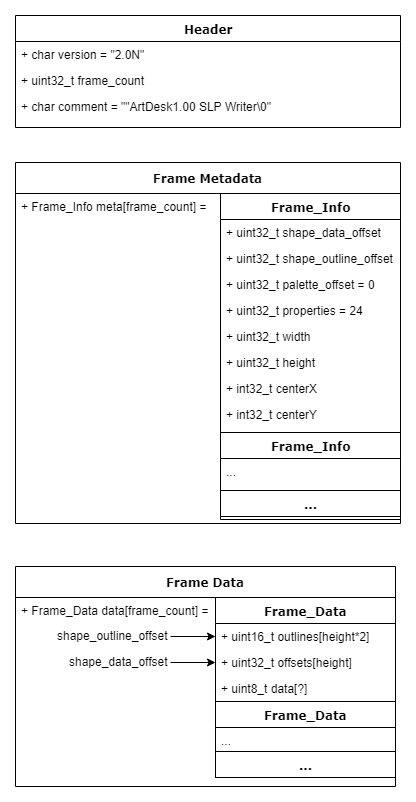

# SLP File Spec

## Preamble

SLP files are the image asset storage method for the [Genie Engine](https://en.wikipedia.org/wiki/Genie_Engine), used in games such as Age of Empires 2: HD. This file seeks to collect my notes on the SLP file format, and hopefully serve as a resource to developers looking to accomplish something with the SLP files.

Here are some places I have pulled my resources:
* https://web.archive.org/web/20160801213608/http://www.boekabart.net/aoe2wide/hg/slp.txt
* https://web.archive.org/web/20131127014051/http://www.digitization.org:80/wiki/index.php/SLP
* https://github.com/fredreichbier/genie
* https://github.com/genie-js
* https://github.com/Tapsa/AGE
* And, of course, looking at raw SLP files.

For consistency and clarity, here are some standards which I will maintain throughout this paper:
* I am working exclusively with Age of Empires 2: HD, though this file standard is used by the Genie engine which powers numerous other games.
* All strings in code examples will **not** be automatically null terminated. Because the developers did not always null terminate strings, `'2.0N'` should not be confused with `'2.0N\0'`.
* All data types in SLP are little endian (e.g. `[0x01, 0x00]` becomes 1, not 256). All data structures are stored in sequential order, C style.
* All structure examples are written in C. I also use [GNU C datatypes](https://os.mbed.com/handbook/C-Data-Types) from `stdint.h`, with a small variation: `(u?)int8_t` means I was unable to find whether or not the number is signed. For most of these numbers the signing doesn't seem to make much of a difference.
* If an element in a structure has an assignment statement to a constant such as `uint8_t thing = 7;` this means that I have not observed this value changing across SLP files, and as a result it is probably safe to ignore. If the assignment statement is to a calculated value such as `uint8_t thing = 7 * WIDTH` the value may change but can be derived by means other than reading it.
* Any offset or file location in an SLP is stored as an absolute byte count from the start of the file. There are no relative offsets.

If you come upon an error or have a question, feel free to shoot me an email at [noah@koontzs.com](mailto:noah@koontzs.com).

## Introduction

SLP files were created as a method for storing sprite animations with a small footprint. At it's core, an SLP file is simply a collection of Bitmaps, with a few special colors and some custom compression.

Each SLP file is assigned to in-game characters by Age of Empires 2: HD in the `empires2_x1_p1.dat` file, where the game has encoded which sprites are used with which units. One SLP file will usually be referenced multiple times in the dat file as the sprite for each civilizations unit, and AoE2 will automatically change the team color based on SLPs special colors feature (see [encoding section](#data)). SLPs will also often contain multiple viewing angles of a sprite as consecutive frames, though the SLP file itself will not indicate this. Information on the playback of the SLP, including the frames-per-angle, the playback speed, or the number of angles stored can be found in the `empires2_x1_p1.dat` file as well.

Images in the SLP when decoded become bitmaps, referencing a color table stored in `empires2_x1_p1.dat`. It was difficult to find this color palette on the internet, so I've made a spreadsheet for reference [here](https://docs.google.com/spreadsheets/d/1AiSjPccqcIGvYRhXO0ogPjmmlHOfLP9EEWkmV4q_P74/edit?usp=sharing).

Design decisions of the file format seems to indicate that it was very important to the developers that the file format take as little space as possible, but still maintain lookup speed. Images in SLPs are heavily compressed using a combination of pre-coded side padding (see [outline section](#outlines)), and custom command-based image encoding (see [encoding section](#data)). For every byte saved however, SLPs replace this with numerous lookup tables (see [offsets section](#offsets)) seemingly placed for optimization purposes.

## Overall Structure

SLP files are encoded as raw binary, using little-endian and a varying word size depending on the section. There are three components to an SLP, in the following order:
* **[Header](#header)**: Struct, contains the version and frame count (32 bytes).
* **[Frame_Metadata](#frame-metadata-array)**: Array of structs, contains metadata on each frame (32*frame count bytes).
* **[Frames](#frame-data)**: Array of structs, contains the encoded images (unknown bytes).

Below is a diagram which hopefully gives a clearer overview of the structure:


Below is more technical overview of each individual section of an SLP.

## Header

```C
typedef struct Header
{
    char         version[4]               = "2.0N";
    uint32_t     frame_count;
    char         comment[24]              = "ArtDesk1.00 SLP Writer\0";
} Header; // 32 bytes
Header header; // 32 bytes
```

As stated above, the header contains information on the version and frame count. Both the version and comment do not change across SLP files in my experience, so the the only property really useful is the `frame_count`.

## Frame Metadata Array

```C
typedef struct Frame_Info
{
    uint32_t     shape_data_offset;    
    uint32_t     shape_outline_offset;
    uint32_t     palette_offset          = 0;
    uint32_t     properties              = 1;
    (u?)int32_t  width;
    (u?)int32_t  weight;
    int32_t      centerX;
    int32_t      centerY;
} Frame_Info; // 32 bytes
Frame_Info frame_info[header.frame_count]; // 32*frame_count bytes
```
Above shows an array of 32 bytes structs, each which contain metadata regarding a single frame of the SLP. The elements in this array are stored in the same order as the frames, with each element referring to an analogous frame in the frames array. The properties are as follows:
* **shape_data_offset**: The location in the file where the offsets and encoded image part of the frame (see [offsets section](#offsets)) starts.
* **shape_outline_offset**: The location in the file where the stored transparent offsets are stored (see [outline section](#outlines)), the same location as the start of the frame element itself (will be less that `shape_data_offset`).
* **palette_offset**: Unknown, always zero.
* **properties**: Unknown, sometimes documented as 10 or 0 but always appears as 24 in my testing.
* **width**: The width of the image. Sprites will vary their sizes during the animation to save space.
* **height**: The height of the image.
* **centerX**: The X coordinate for the pixel to use as the center of the image (where the cursor is).
* **centerY**: The Y coordinate for the center pixel.

## Frame Data

```C
typedef struct Frame_Data {
    // index refers to the frame number
    Outline outlines[frame_info[index].height]; // 4*height bytes
    uint32_t offsets[frame_info[index].height]; // Another 4*height bytes
    uint8_t* data; // Unknown size
} Frame_Data; // Unknown size
Frame_Data frame_data[header.frame_count]; // Unknown size
```

Each frame in Frames is built of the following components:
* **[Outlines](#outlines)**: Array of structs, stores the number of transparent pixels on the left and right of the frame for each row (4*height bytes).
* **[Offsets](#offsets)**: Array of `uint32_t`, stores the location of the start of each row, probably for optimization (4*height bytes).
* **[Data](#data)**: Run-length encoded data, determines the image drawn (unknown bytes).

### Outlines

```C
typedef struct Outline {
    uint16_t left, right;
} Outline; // 4 bytes
// for each frame:
Outline outlines[frame_info[index].height]; // 4*height bytes
```

Stored in the beginning of the frame, the outline array specifies the two things: The offset from the left side of the screen to start drawing, and the offset from the right side of the screen to stop drawing, labeled left and right respectively. Both values are exclusive. In other words, if I have a row of pixels I want to draw below, where 0-10 is a color and -1 is transparent:
| Index |   0   |   1   |   2   |   3   |   4   |   5   |   6   |   7   |   8   |   9   |
| :---: | :---: | :---: | :---: | :---: | :---: | :---: | :---: | :---: | :---: | :---: |
| Pixel |  -1   |  -1   |   2   |   3   |   1   |   4   |  -1   |  -1   |  -1   |  -1   |
I would set the left offset to 2 and the right offset to 4, and only encode the pixels 2-5 inclusive into the image.

### Offsets

```C
uint32_t offsets[frame_info[index].height]; // 4*height bytes
```

Since the image is encoded in such a way that the byte size of each row varies, the developers choose to add a lookup table before the frame data containing the location of the start of each row. In other words, offsets is an array of absolute file locations in bytes skipped for the start of each row of the encoded image. Often when reading the SLP this data is overlooked, however when writing it is important to get this data correct to avoid runaway pointers.

### Data

I found an excellent writeup on the encoding of SLP image data [here](https://web.archive.org/web/20160801213608/http://www.boekabart.net/aoe2wide/hg/slp.txt). For ease of use, I've pasted it here and edited it based on my research, and added some formatting. A huge thanks to the original author who remains unknown, as I could not have decoded an SLP without them.

The actual SLP data starts at the `shape_data_offset + sizeof(offsets)`, that is at the data offset but after the offsets for each row. The data is run-length encoded using a set of 15 commands, and uses these commands to decode into a bitmap of `uint8_t` per pixel. This bitmap then references colors in a palette built into the game (see [Introduction](#introduction)) at runtime. You start by taking the first byte in the data for the line and acting on it as a command. The command code itself is stored in the low-nibble of the byte, e.g. `command = data & 0x0f`.

#### case 0, 4, 8, 0x0c: Block Copy (short) (`LLLL LL00`)

In these cases, the length of the block copy is stored in the top 6 bits of the command byte, e.g. `length = command >> 2`. The data to copy follows the command byte and is "length" bytes long. Thus, these commands are good for small chunks of non-repeating data, up to a length of 64 bytes.

#### case 1, 5, 9, 0x0d: Skip pixels (short) (`LLLL LL01`)

These commands skip a range of pixels, up to 64. The length is encoded like with the prior command, i.e. `length = command >> 2`. This command is mainly used to draw an empty space in the middle of a sprite, as it just moves the pointer to the drawing buffer forward.

#### case 2: Block Copy (big) (`0000 0010`)

Like the first Block Copy, but supports ranges > 64 bytes. The top 4 bits of the command byte are shifted left 4 bits and added to the next byte in the command stream to get a length of 0-0xfff, i.e. `length = ((command & 0xf0) << 1) + next_byte`. Following that is the stream of data to copy, of size "length".

#### case 3: Skip pixels (big) (`0000 0011`)

The length is determined just like the big block copy command (`length = ((command & 0xf0) << 1) + next_byte`), and it behaves like the other skip command in that it just moves the pointer to the drawing buffer.

#### case 6: Copy & Transform block (`LLLL 0110`)

The length of this block is determined by the high 4 bits of the command byte. If they are non-zero, then the length is in the range of 1-15. If the high 4 bits are zero, then the next byte in the stream is read and used as the length.

After that, a range of "length" bytes is read, and each byte is bitwise or-ed with the player number (1-8) shifted right by four to determine the final color of the byte, e.g. `final_index = (player_color << 4) | color`. The palette is set up such that the first eight colors of the (1-7) multiples of sixteen is a team-specific color, which allows for this trick.

#### case 7: Fill block (`LLLL 0111`)

The length is determined as with case 6. The next byte in the stream determines the color of the run. The run length is then filled with this color for "length" bytes.

#### case 0x0a: Transform block (`LLLL 1010`)

The length is determined as in cases 6 and 7. The next byte in the stream determines the initial color of the block run, and it is and-ed to the shadow "and" mask, and then or-ed to the shadow "or" mask. These masks are typically something like `0xff00ff00` and `0x00ff00ff`, and are used to draw shadow effects in the game. This is typically used to overlay a checkerboard shadow sprite onto the existing buffer.

#### case 0x0b: Shadow pixels (`LLLL 1011`)

The length is determined as in cases 6, 7 and 0x0a. For the length of the run,
the destination pixels already in the buffer are used as a lookup into a
"shadow table" and this lookup pixel is then used to draw into the buffer. The
shadow table is typically a color-tinted variation of the real color table, and
is generally used to draw things like the red-tinted checkerboard sprites when
you try to place a building in an area where it cannot be placed.

#### case 0x0e: Extended commands (`0XXX 1110`)

The high 4 bits are used to determine an extended command, so the entire
command byte is used. These commands are mainly used to draw the sprite
outlines that you see when you move behind trees. The subcommands are as
follows:

* *case 0x0e & 0x1e: (`000X 1110`)*
  
    These commands are used to hint to the renderer about the command that
follows. (The byte immediately following this command is just a regular command
byte.) If the special command is 0x0e, then the command that follows is only
drawn if the sprite is not x-flipped. If the special command is 0x1e, then the
command that follows is only drawn if the sprite is x-flipped.

* *case 0x2e & 0x3e: (`001X 1110`)*

    These set the transform color tables used in the regular commands. 0x2e
sets the renderer for the normal transform color table, 0x3e sets it for the
alternate transform color table.

* *case 0x4e & 0x6e: Draw "special color 1 or 2", 1 byte (`01X0 1110`)*

    The destination draw buffer is filled with 1 byte, which is the color table
value specified by "special color" 1 or 2 (depending on the command). These are
typically the colors that are used to draw the outline color that you see when
a sprite moves behind a tree. Special color 1 is usually the player color,
special color 2 is (in the case of SWGB) typically black to enhance the
outline.

* *case 0x5e & 0x7e: Draw "special color 1 or 2" as a run (`01X1 1110`)*

    The byte following the special command is used to determine the length of
the run. The destination buffer is filled with the special color 1 or 2 for
"length" bytes.

* *case 0x8e through 0xfe. These are unused. (`1XXX 1110`)*

#### case 0x0f: End of Line (`XXXX 1111`)

Presence of this command indicates that the sprite commands for the current
line are finished and that the parser should move onto the next vertical line
in the sprite.